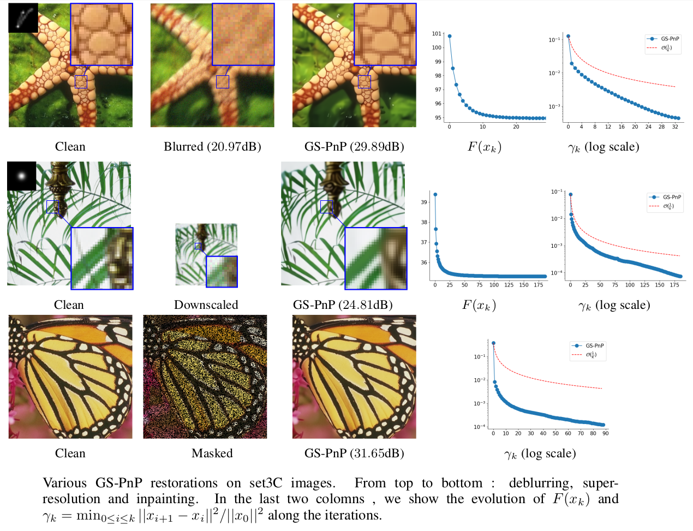

# Gradient Step Denoiser for convergent Plug-and-Play [[Paper](https://arxiv.org/pdf/2110.03220.pdf)]

[Samuel Hurault](https://www.math.u-bordeaux.fr/~shurault/), [Arthur Leclaire](https://www.math.u-bordeaux.fr/~aleclaire/), [Nicolas Papadakis](https://www.math.u-bordeaux.fr/~npapadak/). \
[Institut de Mathématiques de Bordeaux](https://www.math.u-bordeaux.fr/imb/spip.php), France.


 

## Prerequisites


The code was computed with Python 3.8.10, PyTorch Lightning 1.2.6, PyTorch 1.7.1

```
pip install -r requirements.txt
```

## Gradient Step Denoiser (GS-DRUNet)

The code relative to the Gradient Step Denoiser can be found in the ```GS_denoising``` directory.

### Training 

- Download training dataset from https://drive.google.com/file/d/1WVTgEBZgYyHNa2iVLUYwcrGWZ4LcN4--/view?usp=sharing and unzip ```DRUNET``` in the ```datasets``` folder
- Realize training
```
cd GS_denoising
python main_train.py --name experiment_name --log_folder logs
```
Checkpoints, tensorboard events and hyperparameters will be saved in the ```GS_denoising/logs/experiment_name``` subfolder. 

### Testing 

- Download pretrained checkpoint from https://drive.google.com/file/d/1aafXsJG50FHdNIBYfQZ2jRKTfY0ig6Zi/view?usp=sharing and save it as ```GS_denoising/ckpts/GSDRUNet.ckpt```
- For denoising the whole CBSD68 dataset at input Gaussian noise level 25 :
```
cd PnP_restoration
python denoise.py --dataset_name CBSD68 --noise_level_img 25
```
Add the argument ```--extract_images``` the save the output images.

## Gradient Step PnP (GS-PnP)

### Deblurring

- If not already done, download pretrained checkpoint from https://drive.google.com/file/d/1aafXsJG50FHdNIBYfQZ2jRKTfY0ig6Zi/view?usp=sharing and save it as ```GS_denoising/ckpts/GSDRUNET.ckpt```
- For deblurring the CBSD10 images at input Gaussian noise level ```7.65```, sequentially blurred with the 10 different kernels exposed in the paper:
```
cd PnP_restoration
python deblur.py --dataset_name CBSD10 --noise_level_img 7.65 
```


Add the argument ```--extract_images``` the save the output images and ```--extract_curves``` the save convergence curves.


### Super-resolution

For performing super-resolution of CBSD10 images, downscaled with scale ```sf```, Gaussian noise level ```7.65```, and  sequentially blurred with the 8 different kernels exposed in the paper:
```
cd PnP_restoration
python SR.py --dataset_name CBSD10 --noise_level_img 7.65 --sf 2
```

### Inpainting
Inpainting on set3C images, with randomly masked pixels (with probability ```prop_mask = 0.5```) sequentially blurred with the 10 different kernels exposed in the paper:
```
cd PnP_restoration
python inpaint.py --dataset_name set3c --prop_mask 0.5
```

## Acknowledgments

This repo contains parts of code taken from : 
- Deep Plug-and-Play Image Restoration (DPIR) : https://github.com/cszn/DPIR 


